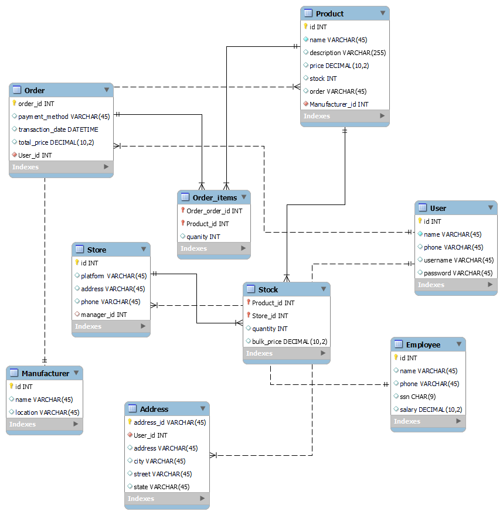

# BabyGhost Streetwear Management System

## Overview

BabyGhost Streetwear, founded by Yaya Yao, is a brand that celebrates creativity, inclusivity, and the unique blend of street style fashion inspired by the art and dance of exceptional children. Our management system is designed to enhance operational efficiency and provide comprehensive analytics on sales, customer trends, and inventory, ensuring our offerings remain aligned with our brand's mission.

## Database Structure

The BabyGhost Streetwear Management System is intricately designed to simulate what an immersive employee environment would be like, enabling staff to interact seamlessly with our database through a series of sophisticated applications. These applications are engineered to leverage complex SQL queries that delve into extensive analytics, covering sales metrics, customer trends, and comprehensive inventory management.## Logical Design

## Applications

Our system features six key applications that are critical for daily operations and strategic analysis:

1. **Sales Tracking:** View total sales per store.
2. **Customer Engagement:** Identify top purchasers.
3. **Inventory Management:** List products that are currently out of stock.
4. **Market Analysis:** Find best-selling products by category.
5. **Revenue Calculation:** Calculate total revenue and quantity sold per product.
6. **Regional Sales:** Track purchases by users from specified regions.

These applications are accessed via a simple and intuitive front-end interface, designed to facilitate quick and effective data retrieval and analysis by our employees.

